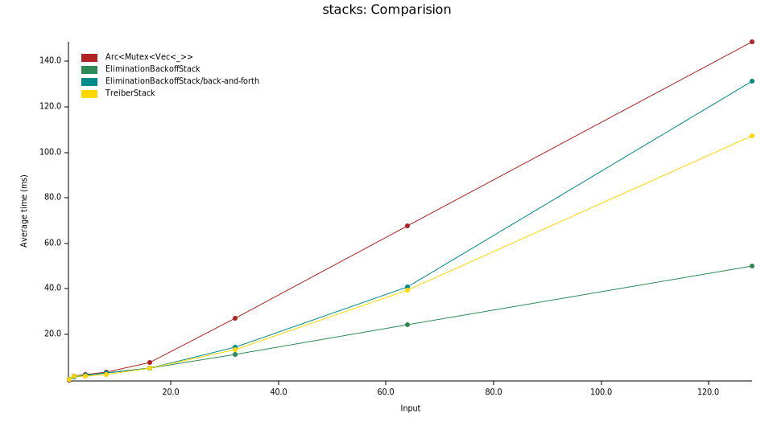

**Work in progress**

Before you consider using this ask yourself the following questions:

- *Is my workload running on a machine > 8 cores?*

    If not you likely won't see enough contention that an elimination back-off
    stack outperforms a classic Treiber stack or even an `Arc<Mutex<Vec<T>>>`.

- *Do I trust the author's use of atomics?*

    If yes, take a look at all `grep -r -E "compare_and_set"` anyways.

- *Do I need a single coordination point through a stack to solve my problem?*

    Think about how you could solve your problem in a parallel fashion requiring
    less coordination.

# Lock-free elimination back-off stack

A normal lock-free Treiber stack [1] linearizes concurrent access through a
single atomic `head` pointer on which `push` and `pop` operations loop trying to
compare-and-swap it. Usually one uses exponential backoff to circumvent
contention. This results in a single sequential bottleneck and a lot of cache
coherence traffic.

A [lock-free elimination back-off
stack](https://people.csail.mit.edu/shanir/publications/Lock_Free.pdf) wraps
such a lock-free Treiber stack, but instead of simply exponentially backing off
on compare-and-swap failures, it uses something called an `EliminationArray`.
Each slot within such an `EliminationArray` enables a thread executing a `push`
operation to hand its item over to a thread executing a `pop` operation. On
contention a thread tries to *exchange* on a randomly chosen slot within the
`EliminationArray`. On failure of such an *exchange* it loops to the beginning
retrying on the stack again.

The result is a lock-free stack that is both _linearizable_ and _parallel_.

### Silly Benchmark

Criterion test comparing:

- `Arc<Mutex<Vec<_>>>`

- `TreiberStack`

- `EliminationBackoffStack` - Simply switching back and forth between stack and
elimination array.

- `EliminationBackoffStack` - Exponentially backing off from the stack to the
elimination array both in space and time.

X-Axis: Number of competing threads.

Y-Axis: Average time it took all threads to push and pop 1000 items each.

[1] Treiber, R. Kent. Systems programming: Coping with parallelism. New York:
International Business Machines Incorporated, Thomas J. Watson Research Center,
1986.
